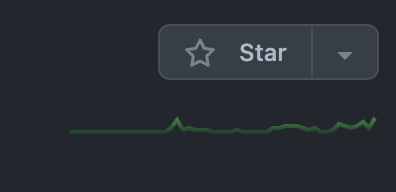
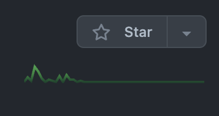

# 1. List

레디스의 List 는 문자열을 저장하는 Linked-List 자료구조이며 지원되는 명령어들을 사용하여 Stack 이나 Dequeue 로 사용할 수 도 있습니다.
주요 명령어는 다음과 같습니다.

- LPUSH : left push. 리스트 왼쪽으로 원소를 삽입합니다.
- LPOP : left pop. 리스트 가장 왼쪽의 원소 하나를 꺼냅니다. 해당 원소는 리스트에서 제거됩니다.
- RPUSH : right push. 리스트 오른쪽으로 원소를 삽입합니다.
- RPOP : right pop. 리스트 가장 오른쪽의 원소 하나를 꺼냅니다. 해당 원소는 리스트에서 제거됩니다.
- LLEN : left length. 리스트의 크기를 알려줍니다. 리스트 전체의 길이를 알려주므로, right length 같은 명령어는 없습니다.
- LRANGE : left range. 리스트 왼쪽에서 몇개의 원소를 지정하여 반환합니다. 인덱스를 음수로 지정하여 오른쪽부터 인덱싱을 할 수 있으므로 right range 는 없습니다.
- LTRIM : left trim. 리스트의 왼쪽에서부터 정해진 길이까지만 보존하고 나머지 원소는 제거합니다. 인덱스를 음수로 지정하여 오른쪽부터 인덱싱을 할 수 있으므로 right trim 은 없습니다.

# 2. 최근 몇 단위 기간의 그래프 데이터를 저장하기
레디스 리스트를 사용하여, 현재부터 지난 몇 기간동안의 변화를 기록할 수 있습니다.



위의 사진은 깃헙 리포지토리에 대한 커밋내역 그래프 예시입니다. 
커밋 그래프는 최근 1년간의 변동만을 보여줍니다.



따라서 위의 사진처럼, 해당 리포지토리에 커밋 횟수가 줄어들수록 과거의 커밋내역이 표시된 솟아올랐던 부분은 점점 뒤로(좌측으로) 밀려가게 됩니다.
만약 현재로부터 최근 1년간 커밋이 전혀 없게 된다면 저 그래프는 완전히 일직선 모양으로 변할겁니다.

위의 그래프를 그리기 위해 필요한 데이터를 레디스 리스트 자료구조에 저장해보도록 하겠습니다.
저는 예제를 위해 스프링부트의 `RedisTemplate`클라이언트를 사용했습니다.

## 2.1 저장
```java
private static Optional<String> keyIntervalCommit(String repoName) {
    if (repoName == null || repoName.isEmpty()) {
      return Optional.empty();
    }
    return Optional.of("interval.commit.list:" + repoName);
}

public void cacheIntervalCommit(String repoName, int commit) {
    if (commit < 0) {
      return;
    }
    
    keyIntervalCommit(repoName)
        .ifPresent(key -> {
          redisRepository.leftPush(key, String.valueOf(commit));
          redisRepository.leftTrim(key, 0, 364);
        });
}
```

먼저 결정해야 하는 정책은 그래프가 최근 몇 단위기간 동안의 변화를 보여주는가 입니다. 위의 코드는 최근 1년간(365일)의 데이터를 기록하는 것입니다.
거기에 더해서 1년간의 커밋 내역을 얼마나 세밀하게 표현할 것인지 결정해야 합니다. 최근 1년간의 기간은 동일하지만 커밋 횟수를 하루 단위로 합하여 표현하는 것과
한 달 단위로 묶는 것 을 비교한다면, 그래프의 수평축 스케일이 서로 크게 다르게 보일 것입니다.

위의 코드는 최근 1년간의 1일 단위의 커밋 횟수를 저장하고 있습니다. 별도의 스케쥴러가 `cacheIntervalCommit`메소드를 하루에 한 번 호출하면서 그 날의
해당 리포의 커밋횟수를 합산한 값을 `commit`파라미터의 인자로 넘겨주는 것을 가정했습니다.

또한 해당일에 커밋이 전혀 없더라도 리스트에 아무런 데이터를 넣지 않는다면 리스트를 트림하면서 일정 길이로 유지할 수 없습니다.
따라서 커밋이 전혀 없는 날에도 `0`을 넣어주기 위해서 `commit` 파라미터를 `null` 를 허용하지 않는 `int`로 메소드 시그니처를 만들어서, 커밋이 없는 날에는
`0`을 전달하는 책임을 스케쥴러가 가지도록 했습니다.

```java
redisRepository.leftPush(key, String.valueOf(commit));
```

인자로 넘어온 오늘의 커밋 횟수 합산 값을 리스트의 왼쪽으로 삽입합니다. 따라서 이 리스트는 왼쪽이 가장 최신의 데이터입니다.

```java
redisRepository.leftTrim(key, 0, 364);
```

리스트를 트림합니다. 우리의 예제는 최근 1년간의 1일 단위를 저장하므로 365개의 데이터를 유지하도록 트림합니다. 트림 명령어는 'zero-based index' 를 사용하므로
0, 364로 지정합니다.
만약 최근 1년간의 1달 단위로 저장한다면 `leftTrim`의 두 번째 인자는 11가 될 것입니다.


## 2.2 조회
```java
public List<Integer> fetchIntervalCommit(String repoName) {
    return keyIntervalCommit(repoName)
        .map(key -> redisRepository.leftRange(key, 0, -1))
        .map(list -> list.stream()
            .map(Integer::parseInt)
            .collect(toList()))
        .orElse(Collections.emptyList());
}
```

데이터를 조회하기 위해서 `leftRange` 명령어를 사용합니다. 데이터를 저장할 때 마다 알맞은 길이로 트림을 하고 있으므로, 리스트의 전체 데이터를 가져 오도록
`leftRange` 명령어의 인덱스 인자를 0, -1로 지정합니다. 그리고 이 메소드의 반환 타입은 `List<Integer>`이므로, 조회에 실패했을때 `null`을 반환하지 않고
빈 리스트를 반환하도록 했습니다.

# 3. 최근 몇 단위 기간의 특정 값의 합계 저장하기

다른 사례로 '최근 24시간 동안의 방문자 수' 혹은 '최근 24시간 동안의 거래량' 등의 데이터가 필요한 경우가 있습니다. 

이런 경우는 '오늘의 방문자 수' 같은 경우와는 조금 다릅니다.
'오늘의 방문자 수' 는 오늘이 지나면 그 데이터가 '0' 으로 초기화 되지만, 앞서 말씀드린 '최근 24시간 동안의 방문자 수' 는 '오늘'이란 기준이 지나더라도
처음 조회한 시각으로부터 아직 24시간이 지나지 않았다면 그 값이 '0'은 아닐 것입니다. 이러한 유형의 데이터는 앞선 예제의 그래프와 같이 연속적인 흐름으로 변화하는 값입니다.

## 3.1 저장
```java
private static Optional<String> keyVisitCountList(String pageName) {
    if (pageName == null || pageName.isEmpty()) {
      return Optional.empty();
    }
    return Optional.of("visit.count.list:" + pageName);
}

private static Optional<String> keyVisitCountSum(String pageName) {
    if (pageName == null || pageName.isEmpty()) {
      return Optional.empty();
    }
    return Optional.of("visit.count:" + pageName);
}
  
public void cacheVisitCount(String pageName, int count) {
    Optional<String> optListKey = keyVisitCountList(pageName);

    if (!optListKey.isPresent()) {
      return;
    }

    String keyVisitList = optListKey.get();
    redisRepository.leftPush(keyVisitList, String.valueOf(count));

    int out = 0;
    Optional<Long> optLen = redisRepository.leftLength(keyVisitList);
    
    if (optLen.isPresent() && optLen.get() > 60 * 24) {
      out = Integer.parseInt(redisRepository.rightPop(keyVisitList).orElse("0"));
    }

    Optional<String> optSumKey = keyVisitCountSum(pageName);
    
    if (!optSumKey.isPresent()) {
      return;
    }

    String keyVisitSum = optSumKey.get();
    Integer sum = redisRepository.get(keyVisitSum)
        .map(Integer::parseInt)
        .orElse(0);

    sum = Math.max(0, sum - out + count);

    redisRepository.set(keyVisitSum, String.valueOf(sum));
}
```
그래프 예제와 마찬가지로 이번에는 기간과 갱신주기에 대한 정책을 먼저 결정해야 합니다.
위의 코드는 최근 24시간을 기록하며 데이터의 갱신주기는 1분 단위 입니다. 별도의 스케쥴러가 1분 단위로 해당 페이지의 방문자 수를 합산하여 이 메소드를 호출하는 것으로
가정했습니다.

```java
redisRepository.leftPush(keyVisitList, String.valueOf(count));
```

먼저 이번 라운드(1분 주기)에 전달된 방문자 수를 리스트에 추가합니다. 리스트의 왼쪽이 최신 값으로 설정헸습니다.

```java
if (optLen.isPresent() && optLen.get() > 60 * 24) {
      out = Integer.parseInt(redisRepository.rightPop(keyVisitList).orElse("0"));
}
```

리스트의 길이가 정책으로 정한 길이(24시간동안 1분 단위이므로 60 * 24 개의 데이터를 저장)를 초과하면 가장 오래된 원소를 제거합니다.
제거된 원소는 누계에서 빼줘야 하므로, 이번에는 `leftTrim` 을 사용하지 않고 `rightPop` 을 사용했습니다.

```java
Integer sum = redisRepository.get(keyVisitSum)
    .map(Integer::parseInt)
    .orElse(0);

sum = Math.max(0, sum - out + count);
redisRepository.set(keyVisitSum, String.valueOf(sum));
```

방문자 수 누계를 추적하기 위해 매번 리스트 전체의 원소를 합산할 수 도 있지만, 이 예제에서는 별도의 키에 해당 데이터를 기록하고 있습니다. 
그 값을 조회하여 이번 라운드에서 제거될 값을 빼주고, 새로 추가된 값을 더해줍니다. 그리고 갱신된 데이터를 기존의 키에 저장합니다.

## 3.2 조회
```java
public int fetchVisitCount(String pageName) {
    return keyVisitCountSum(pageName)
        .flatMap(redisRepository::get)
        .map(Integer::parseInt)
        .orElse(0);
}
```
조회는 그래프 예제와 달리, 리스트에서 조회할 필요가 없고 별도로 누계를 기록하고 있는 키에서 바로 조회합니다.


# 4. 마무리
이번 포스팅에서는 제가 레디스의 리스트 자료구조를 활용해서 만들었던 간단한 예제들을 소개해보았습니다. 
코드상 오류가 있거나 위의 예제들을 구현하기 위한 더 나은 방법이 있다면 댓글로 알려주시면 감사하겠습니다!