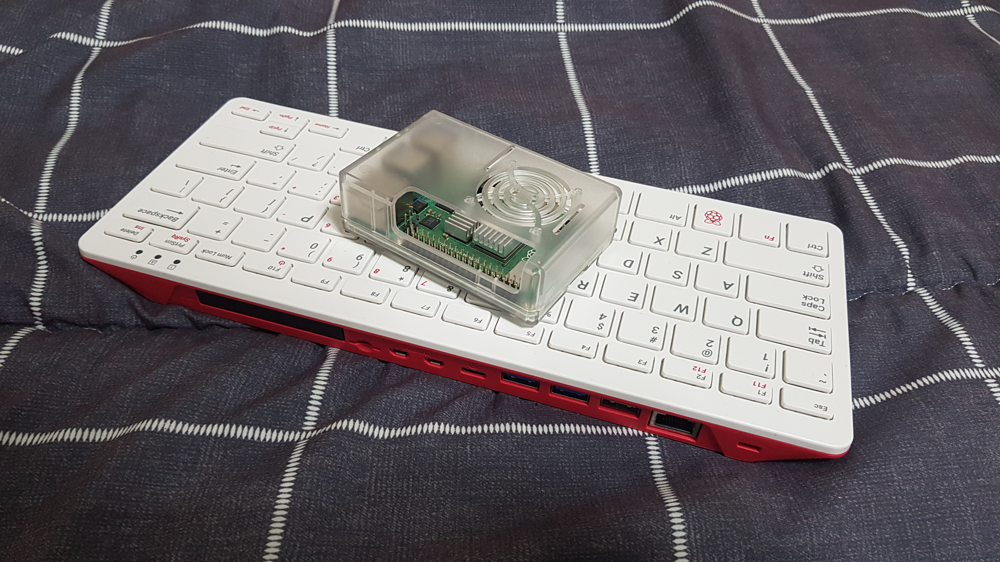
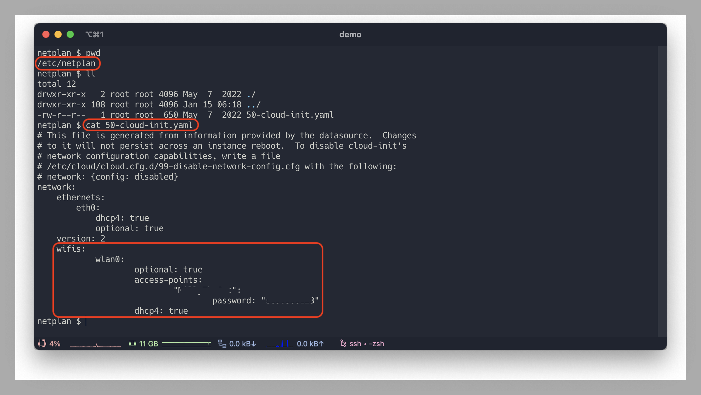

향후 완성될(언제가 될지 모르는) 토이 프로젝트 웹 서비스 배포를 준비하기 위해 집에있는 컴퓨터를 서버로 사용해 보겠습니다.
예제에서는 매우 간단한 프론트와 백엔드 데모 프로그램을 배포하겠습니다. 그리고 포스팅을 위해 일회성으로 도메인도 구입하여 연결 해보겠습니다.

---

# 1. 서버 준비

## 1.1 우분투 설치

저를 포함한 대부분의 사람들은 집에 서버나 워크스테이션급의 컴퓨터가 없습니다. 그러니 집에 굴러다니고 있는 라즈베리 파이를 하나 골라서 서버로 사용해 볼까 합니다.
저는 라즈베리 파이에 우분투 서버 20을 설치하여 사용중입니다. 라즈베리 파이에 우분투를 설치하는 방법은 [여기](https://ubuntu.com/download/raspberry-pi)에서 확인하실 수 있습니다.

> 라즈베리 파이의 전원 공급은 전용 어댑터를 사용하거나 5V 3A 출력의 어댑터를 사용해야 합니다.
> 
> 또한 어댑터를 멀티탭에 연결하는 것 보다, 벽면 콘센트에 바로 연결하거나 전기를 안정적으로 공급할 수 있는 용량이 큰 멀티탭을 사용하는것이 좋습니다.
> 전원공급이 불안정하면 부팅이 안되거나 비정상적인 재시작이 발생했습니다.

라즈베리 파이가 없더라도 서버로 사용할 항상 켜져있는 컴퓨터가 있다면 상관없습니다.

## 1.2 네트워크 연결

서버가 준비되었다면 우리집의 로컬 네트워크에 연결합니다. 랜선을 사용하여 유선으로 연결할 수 도 있고, 와이파이로 무선 연결을 해도 좋겠지요.

> 저는 우분투 설치과정에서 와이파이 연결 설정을 했었지만 잘 동작하지 않았습니다. 검색 결과 해결한 방법은 아래와 같습니다.
> 
> `access-points` 아래 뎁스의 따옴표에 와이파이 이름을 입력합니다. 그리고 그 다음 뎁스의 `password` 항목에 와이파이 비밀번호를 입력합니다.
> 두 경우 모두 따옴표로 감싸야합니다. 또한 파일포맷이 `YAML` 이므로, 들여쓰기를 반드시 지켜줘야 합니다.
> 

