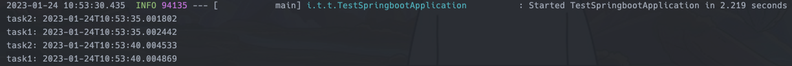

# 1. 실행자 프레임워크와 스프링 스케쥴러

배치(batch)작업이 없는 비교적 간단한 스케쥴러도 스프링 부트(이하 스프링) 프로젝트에서 많이 사용하고 있습니다.
저는 이런 간단한 루틴의 스케쥴러는 자바 동시성 패키지의 '실행자 프레임워크(Executor Framework)'와 `CompletableFuture`를 조합하여 직접 구현하거나,
혹은 스프링이 제공하는 스케쥴링 API 를 사용합니다.

특히 크론(cron) 표현식을 사용해야 하는 스케쥴링은 스프링 기능을 사용합니다. 왜냐하면 자바 실행자 인터페이스는 크론 표현식을 인자로 받지 않기 때문입니다.(자바8 기준)
직접 크론 표현식 파서를 만들어서 실행자 프레임워크에 적용하는 헬퍼를 만들거나 아니면 스프링의 파서만 사용할 수 도 있겠지만, 굳이 그럴거면 그냥
스프링의 기능을 처음부터 사용하는게 낫다고 생각했습니다.

그리고 어느날 문득 스케쥴러의 크론 주기를 런타임시에 변경할 수 있는 요구사항이 추가된다면 어떻게 해야할까 하는 의문이 생겼습니다. 실행자 프레임워크로 직접 작성한
스케쥴러는 변경과 재시작을 쉽게 생각해볼 수 있는 반면에 스프링의 스케쥴러는 아직 생각해본적이 없었습니다.

```java
@EnableScheduling
@SpringBootApplication
public class TestSpringbootApplication {

  public static void main(String[] args) {
    SpringApplication.run(TestSpringbootApplication.class, args);
  }

  @Scheduled(cron = "*/5 * * * * *")
  public void task() {
    System.out.println(LocalDateTime.now());
  }
}
```

위 코드는 스프링에서 스케쥴러를 등록하고 실행하는 방식 중 간단한 방법입니다. 만약 해당 태스크의 크론 스케쥴을 런타임에 변경하고 싶다면 어떻게 해야할까요?

```java
@Scheduled(cron = "${props.cron}")
public void task() {
  System.out.println(LocalDateTime.now());
}
```
```yaml
props:
  cron: */5 * * * * *
```

크론 표현식을 프로퍼티로 이동시키고 `@Scheduled`의 `cron` 속성에 프로퍼티를 참조하고 난 뒤애, 실행중인 서버에 프로퍼티 값을 변경하고 이 스케쥴러를 재시작해야 합니다.
이는 좀 귀찮은 작업이므로 좀 더 간단하게 변경 할 수 있는 방법을 찾아보았습니다.

# 2. ScheduledTaskRegistrar

위 코드에서처럼 `@Scheduled` 어노테이션이 붙은 `Runnable` 구현체(인자를 받지않고 아무것도 반환하지 않는)는 스프링이 `ScheduledTaskRegistrar` 빈에
태스트(task)로 등록한 뒤 실행시켜 줍니다. 스프링 부트는 우리가 직접 해당 빈을 생성하지 않아도 자동으로 생성해주는 것입니다.

## 2.1 직접 빈을 생성 후 스케쥴러 등록

```java
@EnableScheduling
@SpringBootApplication
public class TestSpringbootApplication {
  public static void main(String[] args) {
    SpringApplication.run(TestSpringbootApplication.class, args);
  }
  
  @Bean
  public ScheduledTaskRegistrar scheduledTaskRegistrar() {
    ScheduledTaskRegistrar registrar = new ScheduledTaskRegistrar();
    CronTask task0 = new CronTask(() -> 
        System.out.println("task0: " + LocalDateTime.now()), "*/5 * * * * *");
    registrar.addCronTask(task0);
    
    return registrar;
  }
  
  @Scheduled(cron = "*/5 * * * * *")
  public void task1() {
    System.out.println("task1: " + LocalDateTime.now());
  }
}
```

이번에는 직접 `ScheduledTaskRegistrar` 빈을 생성 하면서 동시에 '태스크0'을 등록했습니다.
`CronTask` 클래스의 생성자 시그니처는 다음과 같습니다. `CronTask(Runnable runnable, String expression)`.
이제 서버를 실행해봅니다.



직접 등록한 '태스크0'과 어노테이션으로 등록된 '태스크1'이 잘 작동되는 것을 확인할 수 있습니다.

## 2.2 등록되어 있는 태스크를 수정하기

