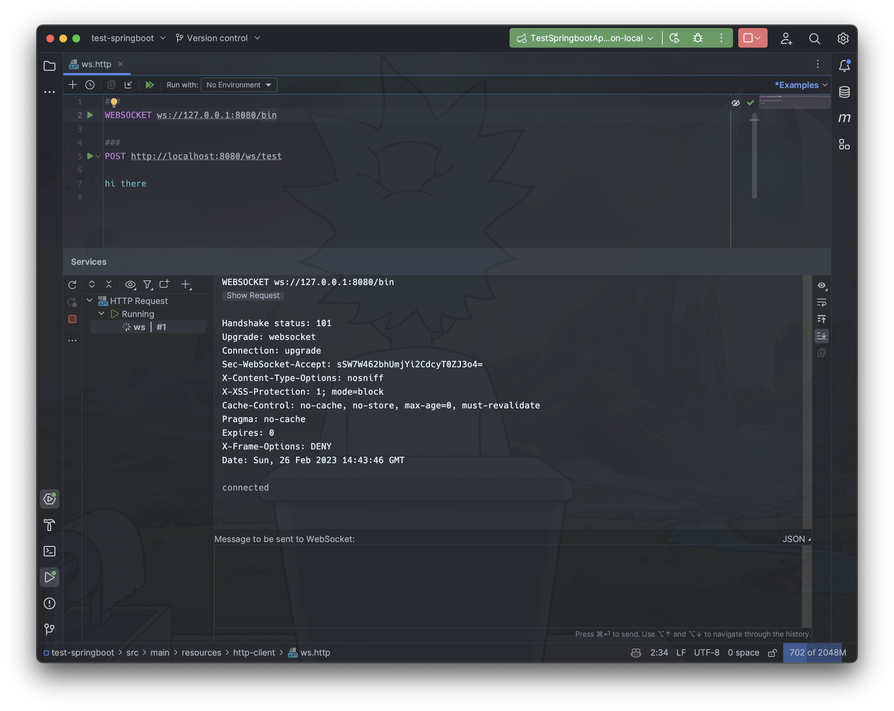
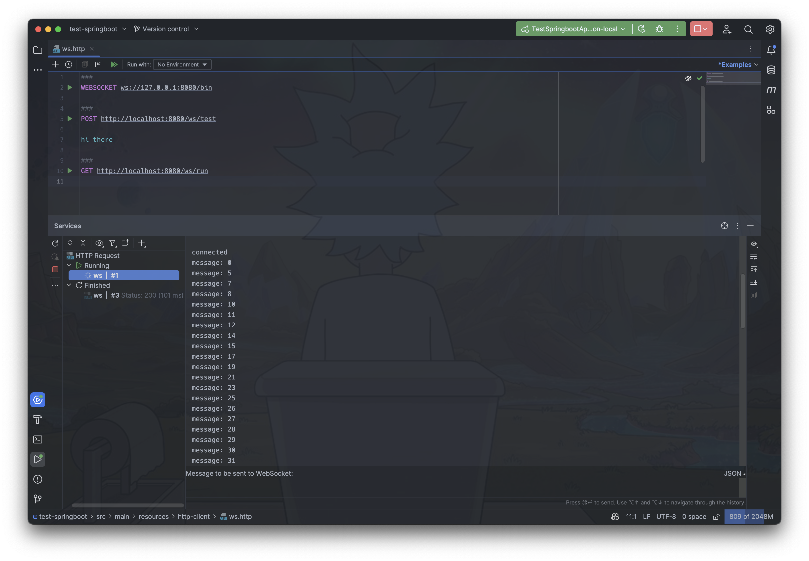
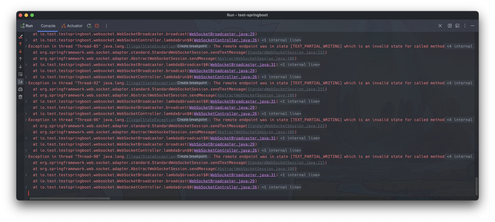

웹소켓(WebSocket)은 하나의 TCP 커넥션을 통해서 클라이언트와 서버간의 양방향 통신을 지속하게 해주는 프로토콜입니다.
제가 실무에서 사용한 용례는 특정 상품의 가격 정보를 나타내는 챠트를 만드는 경우였습니다.

종목의 실시간 정보 및 챠트 데이터 혹은 다른 사례로 채팅의 대화글 등, 
클라이언트가 명시적으로 요청하지 않아도 서버에서 클라이언트의 특정 데이터 상태를 갱신해야만 하는 상황에서 유용한 것 같습니다.

---

# 1. Spring Boot 에서 WebSocket 사용하기

```xml
<dependencies>
    <dependency>
      <groupId>org.springframework.boot</groupId>
      <artifactId>spring-boot-starter-websocket</artifactId>
    </dependency>
</dependencies>
```
스프링부트에서 웹소켓을 사용하는 간단한 방법은 위와 같이 스프링부트 스타터 의존성을 사용하는 것입니다.

```java
@Component
public class WebSocketBroadcaster extends TextWebSocketHandler {

  private final Map<String, WebSocketSession> sessionMap = new ConcurrentHashMap<>();

  public void broadcast(String message) {
    sessionMap.values()
        .forEach(session -> {
          try {
            session.sendMessage(new TextMessage(message));
          } catch (IOException e) {
            e.printStackTrace();
          }
        });
  }

  @Override
  public void afterConnectionEstablished(WebSocketSession session) {
    sessionMap.put(session.getId(), session);
    session.sendMessage(new TextMessage("connected"));
  }

  @Override
  protected void handleTextMessage(WebSocketSession session, TextMessage message) {
    System.out.println(message);
  }

  @Override
  public void afterConnectionClosed(WebSocketSession session, CloseStatus status) {
    try (session) {
      sessionMap.remove(session.getId());
    }
  }
}

```

의존성을 추가한 뒤, 웹소켓 서버 구현을 위해 제공해주는 템플릿 메소드 클래스를 확장합니다. 예제에서는 'TextWebSocketHandler' 타입을 사용했습니다.
이외에도 'BinaryWebSocketHandler' 타입도 있습니다. 패킷 크기를 줄이기 위해 독자적인 인코딩으로 직렬화한다면 이 바이너리 클래스를 확장하면 됩니다.

`afterConnectionEstablished` 메소드을 오버라이딩하여 연결된 클라이언트의 세션을 `ConcurrentHashMap` 컨테이너에 저장합니다.
데모가 아닌 실제 사용시에는 이 세션객체를 구성요소로 하는 추가정보를 포함하는 랩퍼 클래스를 사용할 수도 있겠습니다.

`afterConnectionClosed`메소드를 오버라이딩하여 웹소켓 커넥션이 종료된 경우 수행할 훅을 정의합니다.
세션객체는 `Closeable` 을 구현하고 있으므로 `try-with-resources`을 사용하면 편리합니다.

마지막으로 연결된 모든 세션들에게 데이터를 전달하는 `broadcast` 메소드를 정의했습니다.

```java
@RequiredArgsConstructor
@EnableWebSocket
@Configuration
public class WebsocketConfig implements WebSocketConfigurer {

  private final WebSocketHandler webSocketHandler;

  @Override
  public void registerWebSocketHandlers(WebSocketHandlerRegistry registry) {
    registry.addHandler(webSocketHandler, "/bin");
  }
}

```

작성한 웹소켓 핸들러를 설정 빈 클래스에서 등록합니다. 경로를 다르게 하여 여러개의 핸들러를 등록할 수 있습니다.

---

# 2. 메시지 전달

## 2.1 싱글스레드인 경우
```java
@RequiredArgsConstructor
@RestController
public class WebSocketController {

  private final WebSocketBroadcaster webSocketBroadcaster;

  @PostMapping("/ws/test")
  public ResponseEntity<?> test(@RequestBody String message) {
    webSocketBroadcaster.broadcast(message);
    return ResponseEntity.ok().build();
  }
}

```

우선 싱글스레드로 가장하여 메시지를 브로드캐스팅 해보겠습니다. 위와 같이 컨트롤러 매핑 메소드를 간단하게 작성했습니다.



인텔리제이에서 지원하는 HTTP client 기능을 사용하여 테스트 하겠습니다.
웹소켓은 ws 혹은 wss 스킴을 사용합니다. 우리가 설정한 웹소켓 핸들러는 '/bin' 경로에 매핑되어 있으므로, 해당 URI 로 접속합니다.
접속에 성공하고 'connected' 메시지를 서버로 부터 받았습니다.


준비한 POST 요청을 보내면, 서버에서는 해당 메시지를 모든 연결된 웹소켓 세션의 클라이언트로 브로드캐스팅 합니다.
'hi there' 라는 메시지가 잘 전달되었습니다.

---

## 2.2 멀티스레드인 경우

```java
@GetMapping("/ws/run")
public ResponseEntity<?> run() {
    IntStream.range(0, 100)
        .forEach(n -> new Thread(() -> webSocketBroadcaster.broadcast("message: " + n)).start());

    return ResponseEntity.ok().build();
}
```

이번에는 서버에서 멀티스레드로 메시지를 웹소켓 클라이언트에게 전달하는 테스트를 하겠습니다.
위 메소드가 호출되면 100개의 스레드를 생성하여 각각의 스레드에서 `broadcast` 메소드를 연속적으로 호출합니다.



메시지가 클라이언트로 전달 되었습니다. 하지만 누락이 있습니다. 전체 메시지의 갯수는 100개가 되어야 하지만 이번 테스트에서는 71개의 메시지만 전달되었습니다.
(당연히 성공한 메시지의 종류와 총 개수는 매 테스트마다 달라질 수 있습니다)



서버의 콘솔을 살펴보면 익셉션이 많이 발생했음을 알 수 있습니다.
이는 하나의 세션에서 아직 전송이 끝나지 않은 상태에서 다른 스레드가 해당 세션에 메시지를 전송하려고 시도했기 때문입니다.
즉, 자바 명세에 정의된 웹소켓 세션은 스레드 안전(thread-safe)하지 않습니다.

---

# 3. 스레드 안전하게 메시지 전달하기

스프링 멀티스레드 환경에서 안전하게 웹소켓으로 메시지를 전달하기 위해서 아래 방법을 사용해볼 수 있을 것 같습니다.

- `synchronized` 키워드를 사용하여 메소드 동기화를 수행
- 동시성 지원 큐(queue)를 사용하거나 외부 메시징 브로커를 사용
- 스프링에서 제공하는 동시성 지원 데코레이터 사용

---

## 3.1 `synchronized` 키워드 사용

```java
  public synchronized void broadcast(String message) {
    sessionMap.values()
        .forEach(session -> {
          try {
            session.sendMessage(new TextMessage(message));
          } catch (IOException e) {
            e.printStackTrace();
          }
        });
  }
```

`broadcast` 메소드에 `synchronized` 키워드를 추가하여 동기화를 수행하면 스레드 안전하게 메시지를 전달할 수 있습니다.


이번에는 100개의 메시지가 예외발생 없이 모두 전달되었습니다.
위에서 언급했듯이, 각 메시지당 하나의 스레드를 생성하므로 메시지의 전달 순서는 보장되지 않습니다.

## 3.2 동시성 지원 큐 사용

이번에는 이 포스트의 제목처럼 `synchronized` 키워드를 사용하지 않고, 대신에 동시성 지원 큐를 사용하여 메시지를 전달해보겠습니다.

```java
@Component
public class WebSocketBroadcaster extends TextWebSocketHandler {

  private final Map<String, WebSocketSession> sessionMap = new ConcurrentHashMap<>();
  private final BlockingQueue<String> messageQueue = new ArrayBlockingQueue<>(500);
  private final ScheduledExecutorService executorService = 
      Executors.newScheduledThreadPool(1);

  @PostConstruct
  public void poll() {
    executorService.scheduleAtFixedRate(() -> {
      List<String> messages = new ArrayList<>();
      messageQueue.drainTo(messages);
      messages.forEach(this::broadcast);
    }, 0, 1, TimeUnit.MILLISECONDS);
  }

  public void enqueue(String message) {
    messageQueue.add(message);
  }

  public void broadcast(String message) {
    sessionMap.values()
        .forEach(session -> {
          try {
            session.sendMessage(new TextMessage(message));
          } catch (IOException e) {
            e.printStackTrace();
          }
        });
  }

  // the rest of the same code...
}
```

