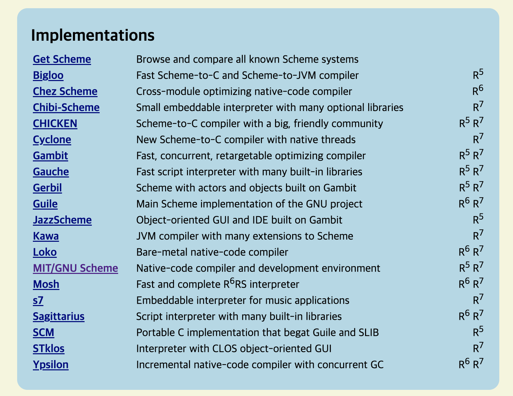
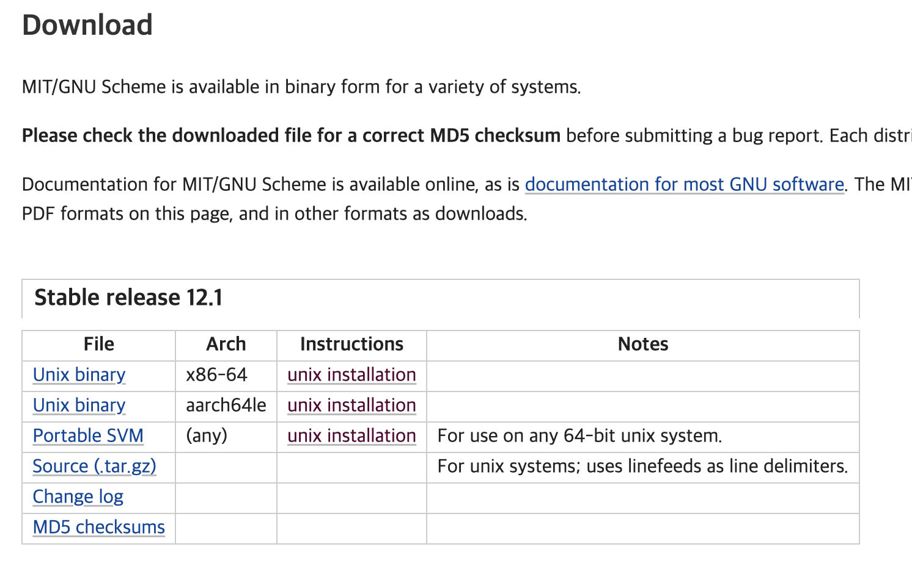

SICP는 'Structure and Interpretation of Computer Programs'의 약자로, 이 책은 '마법사의 책'이라는 별명으로 유명하다고 합니다(책 표지에 마법사가 나옵니다).
이 책은 MIT 컴퓨터과학과 수업에서 사용되었고, 소프트웨어의 기본적인 원리를 설명하면서 예제 코드를 Scheme 이라는 언어로 보여줍니다.

Scheme(스킴)은 Lisp(리스프) 계열의 언어로써, 리스프의 수많은 방언 중 하나입니다.
리스프나 스킴에 대해서는 아직 잘 알지 못하지만, 이 책은 스킴 언어 그 자체에 대한 내용은 아닙니다
(그 예로 최근에는 이 책의 내용을 그대로 전달하되, 스킴 대신 자바스크립트를 사용한 최신 버전의 책이 출간되었습니다).

따라서 스킴을 배운뒤 프로젝트를 진행할 목적이 아니므로, 스킴을 설치하고 책의 예제를 실행할 수 있을 정도의 간단한 환경만 구성하기로 했습니다.

---

# 1. 스킴 설치

## 1.1 구현체 선택

스킴을 다운로드 받기 위해 [https://www.scheme.org/](https://www.scheme.org/) 사이트에 접속합니다.

아래로 조금 스크롤하면 위와 같이 여러 구현체들의 다운로드 페이지 링크가 있습니다.
저는 이 중에서 MIT/GNU Scheme 구현체를 선택했습니다.

위 링크로 이동한 사이트에서 아래로 스크롤 하면 위와 같이 다운로드 가능한 바이너리 목록이 나타납니다.
해당 페이지 상단에서 설명하듯이, MIT/GNU 구현체는 현재 윈도우와 애플 실리콘을 지원하지 않습니다
윈도우는 WSL을 사용하면 될 것 같습니다. 하지만 자기들은 테스트는 해보지 않았다고 합니다 :-)

본인의 컴퓨터 CPU 아키텍처에 맞는 파일을 다운로드 합니다. 저는 인텔 아이맥을 사용중이므로 x86_64(AMD64) 파일을 다운로드 했습니다.
만약 라즈베리 파이 같은 컴퓨터 설치하려면 아래에 있는 aarch64(ARM64) 다운로드 하면 되겠지요.

---

## 1.2 설치

설치는 위의 다운로드 링크 옆에 있는 'unix installation'을 따라서 진행했습니다. 더 자세한 내용은 해당 링크 페이지에서 확인하시면 됩니다.

설치를 진행하기 위해서는 C 컴파일러가 필요합니다. 저는 macOS를 사용하고 있으므로 컴파일러는 Xcode를 통해서 사용합니다.
Xcode가 설치되어 있지않다면 설치 합니다. 그리고 `xcode-select --install` 명령을 통해 커맨드라인 도구를 설치합니다.
그러면 신기하게도 'gcc'로 알리아스 되어있는 'clang' 컴파일러가 설치됩니다.

그리고 만약 현재 Xcode가 설치되어 있지만, 오래걸리는 업데이트 때문에 잠깐 일시정지되어 있는 상태라면 업데이트를 완료 해주어야 합니다.

스킴을 다운로드 받았고 C 컴파일러도 준비되었다면 다음을 진행합니다.

> 아카이브와 압축을 해제 합니다.
> 
> `tar zxvf mit-scheme-12.1-x86-64.tar.gz`

> 압축을 해제한 디렉터리의 src 디렉터리로 이동합니다.
> 
> `cd mit-scheme-12.1-x86-64/src`

> configure 스크립트를 실행합니다.
> 
> `./configure`

> make 명령을 통해 빌드합니다.
> 
> `make`

> make install 명령을 통해 설치합니다.
> 
> `make install`

설치가 정상적으로 완료되었다면 위와 같이 입력하여 버전 정보를 확인할 수 있습니다.

---

## 1.3 REPL 실행

