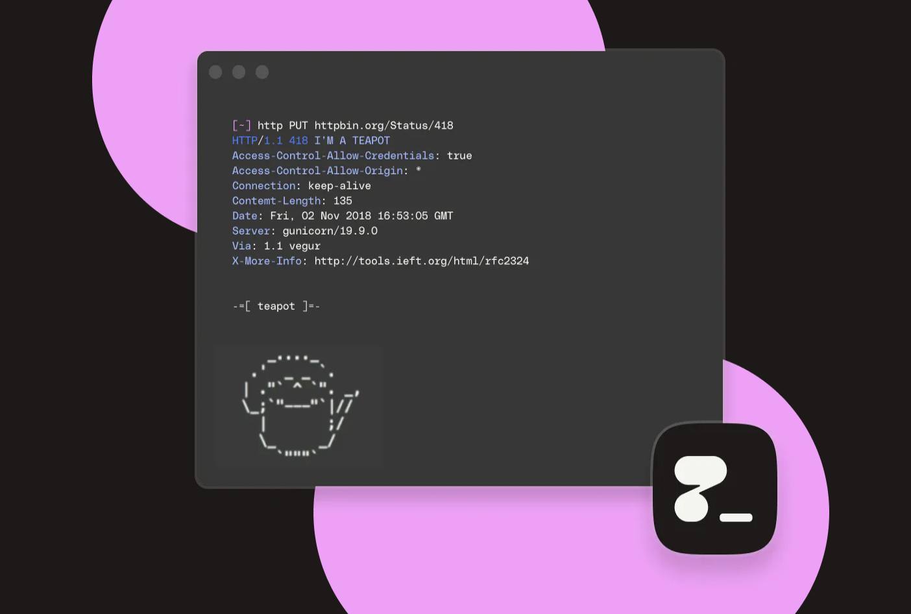
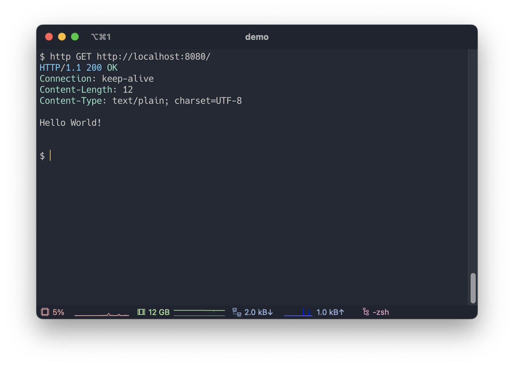
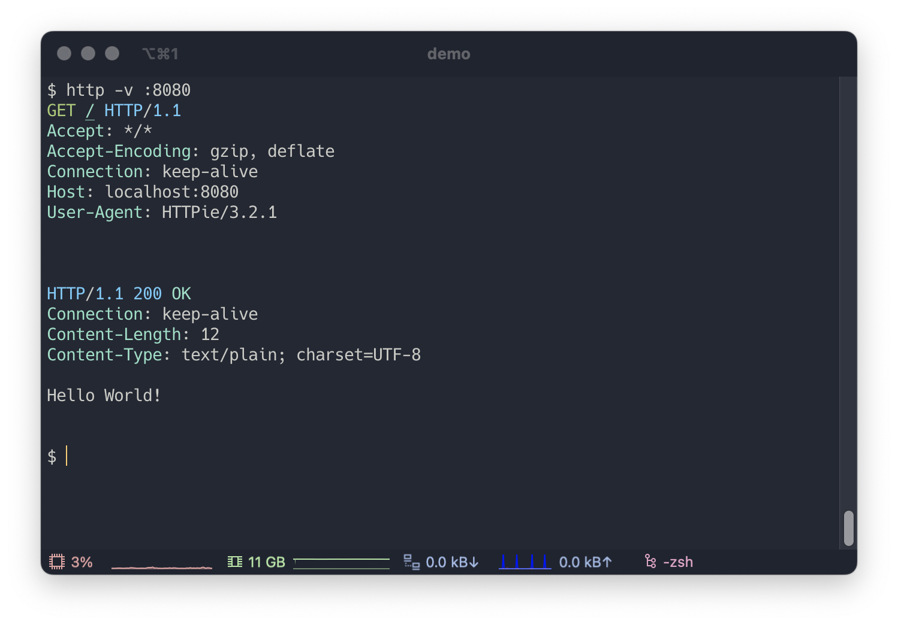

HTTPie("HTTP 파이"로 발음합니다)는 디버깅 및 API 테스트로 사용하는 HTTP 클라이언트 프로그램입니다.
저는 토비님의 스프링부트 강의에서 이 프로그램을 처음 알게되었습니다. HTTPie 는 크게 데스크탑 프로그램과 CLI 프로그램, 이렇게 두 가지 형태가 있습니다.
데스크탑 프로그램은 '포스트맨'을 대체할 수 있고, CLI 프로그램은 'curl' 을 대체할 수 있습니다.

공식사이트에서 말하는 HTTPie 의 특징으론 다음과 같습니다.

- 표현력 좋은 직관적인 문법
- 사용하기 쉬운 JSON
- 색상과 포매팅을 사용하여 읽기쉬운 출력
- API 테스트가 쉽도록 단축문법 지원
- 연속된 테스트를 위해 상태 저장 등등

상세한 내용은 [공식사이트](https://httpie.io/)에서 확인 하실 수 있습니다.

---

# 1. 설치

- 맥
> `brew install httpie`

- 데비안 및 우분투
> `apt install httpie`

그 외 설치방법 [링크](https://httpie.io/docs/cli/installation)

---

# 2. 사용법

## 2.1 기본내용

> `http GET http://localhost:8080/`

위와 같이 `http [method] [scheme][URI]` 형식으로 요청을 보낼 수 있습니다.

> `http http://localhost:8080/` -> GET 메소드 생략 가능
>
> `http localhost:8080/` -> scheme 생략 가능
> 
> `http :8080/` -> localhost 생략 가능
> 
> `http :8080` -> 루트패스 생략 가능

위와 같이 메소드, 스킴 및 로컬호스트는 생략 가능합니다. POST 는 http 바디를 추가하면 생략 가능합니다.

---

> `http -v :8080`

`-v (--verbose)` 옵션을 추가하면 http 요청을 확인할 수 있습니다.

